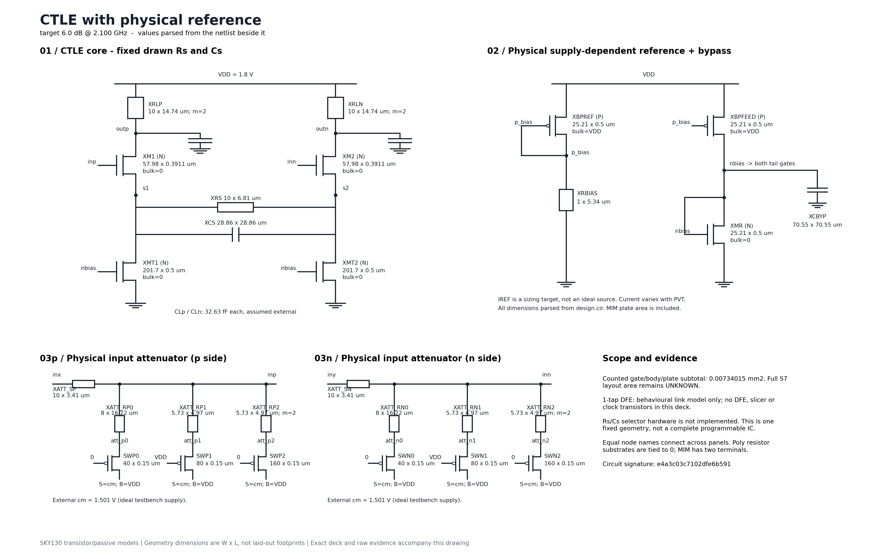

# Nebula

### From equalizer specifications to a sized circuit, checked results and an inspectable design record.

**RL-assisted analog design for a 5 Gbps NRZ CTLE + one-tap DFE, using Python, NGSpice and SkyWater SKY130.**

Astera Labs / BITS Goa competition submission. This repository contains the framework, web application, learned policies and saved engineering evidence. The report and recorded demonstration are submitted separately.

[Run the application](#quick-start) · [Review the results](docs/SUBMISSION_GUIDE.md) · [Explore the source](#source-map)

## What Nebula delivers

| Capability | What it does |
|---|---|
| Target-driven input | Accepts peaking and frequency targets through forms or plain-language requests. |
| RL-assisted candidate selection | Uses a frozen learned policy with safety checks against 512 characterized settings. |
| Physical circuit export | Produces a specific CTLE netlist, device sizing, generated drawing and resulting specifications. |
| Automatic rejection and recovery | Records a failed physical candidate, retains the reason and continues to another candidate without manual selection. |
| PVT and link inspection | Lets the reviewer inspect the selected circuit across 45 process/voltage/temperature combinations and seven constructed channel losses. |
| Traceable downloads | Connects displayed results to exact circuit files, measured data and hash-bound evidence. |
| Receiver integration | Includes separate transistor-DFE and programmable-Rs/Cs receiver prototypes with nominal results. |
| Optional language wrapper | Supports an opt-in LLM interface; local parsing and explanations remain available without a provider. |

The engineering contribution is the complete loop: **target → candidate selection → physical verification → rejection/recovery → circuit and evidence export**. Circuit checks, link behavior and the design record are part of the workflow rather than separate manual steps.

## Quick start

Use a short writable folder. A shallow clone avoids downloading the development history:

```bash
git clone --depth 1 https://github.com/jaikaushik-prog/nebula-ctle-rl.git
cd nebula-ctle-rl
conda create -n nebula-review python=3.13 pip
conda activate nebula-review
python -m pip install -r nebula/requirements-submission.txt
python -m nebula.restore_submission_evidence
python -m nebula.web.recovery_server --port 8766 --no-browser
```

Open **http://127.0.0.1:8766/#results** and keep the terminal open. The current launcher is `nebula.web.recovery_server`; the older server on port 8765 does not expose the current submission features.

The restore command expands the included, losslessly compressed waveform files and checks their original SHA-256 hashes. It downloads nothing and runs no simulations. Saved-result review needs the Python dependencies, but **does not require an installed PDK, a simulator run, training or an LLM key**. The recorded environment is Windows/Python 3.13; fresh installation on every platform has not been certified.

For a saved demonstration, browse the recorded results. **Generate and verify** starts a new design job, and **Profile channel** starts channel analysis; neither is needed to review the submission. Fresh SPICE use requires separately installed NGSpice/SKY130 and local path configuration, described in the [review guide](docs/SUBMISSION_GUIDE.md#fresh-design-runs).

## Start with the selected result

The main saved request is **6 dB near 2.1 GHz**. Its physical recovery record shows:

1. **Setting 288:** rejected at 314/315 conditions after an output-swing guard failed.
2. **Setting 352:** accepted at 315/315 conditions and exported as the final physical CTLE.

The 512 settings are possible candidates, **not 512 final circuits**. Setting 352 is the selected output and has fixed exported Rs/Cs values.

| Selected output | Saved result | Measurement boundary |
|---|---:|---|
| CTLE peaking / peak frequency | 6.6147 dB / 2.1595 GHz | Selected physical CTLE |
| Minimum eye height | 178.288 mV | CTLE response + ideal behavioral DFE |
| Minimum eye width | 0.796875 UI | Same 315-condition modeled eye gate |
| Maximum input-referred noise | 0.680353 mVrms | Selected CTLE |
| Maximum power | 9.80212 mW | Selected CTLE |
| Condition coverage | 315/315 | 45 PVT combinations × seven constructed losses |

The 45 combinations are **TT, SS, FF, SF, FS × 0.95/1.00/1.05 nominal VDD × 0/27/125 °C**. Seven loss points extend this to 315 conditions.



[Selected circuit files and recorded workflow](nebula/product_demo/submission_runs_20260915_v2/4608cf1c525f4e59b2d5226059b0ce5d/) · [Recovery results](nebula/SUBMISSION_RECOVERY_RESULTS_20260915.md)

## A short tour of the app

- **Design explorer:** see the requested target, selected circuit, response, specifications and device sizing. Expand the exact generated drawing and separate receiver evidence.
- **Design PVT:** inspect each process, supply, temperature and channel condition rather than relying on one headline pass count.
- **Compare circuits:** compare saved outcomes, including a separate failed 308/315 workflow. That failed run is distinct from candidate 288 inside the successful recovery record.
- **Run files:** download circuit files and evidence; expand the separate programmable receiver prototype to inspect its physical controls and nominal results.
- **Natural-language input:** turn a request into explicit specifications before deciding to generate. The optional provider is not configured in the saved demonstration; deterministic fallback remains usable.

See the [review guide](docs/SUBMISSION_GUIDE.md) for the exact evidence paths and suggested review order.

## Receiver development and verification scope

Three receiver evidence sets complement the selected CTLE:

| Evidence | Demonstrated result | Relationship to the selected output |
|---|---|---|
| Selected CTLE + transistor DFE | 64/64 decisions; 296.981 mV nominal eye | Exact selected CTLE, separate nominal receiver check |
| Programmable receiver derivative | Physical Rs/Cs controls; 64/64 decisions; 325.629 mV nominal eye | Separate derived prototype, available in Run files |
| 9 dB / 1.9 GHz transistor receiver | Independent calibrated receiver checkpoint and 45-point link PVT | Separate reference circuit; not the selected 6 dB output |

The selected 315-condition gate uses an **ideal behavioral DFE**. The transistor receiver results above do not extend that gate into full receiver signoff. Signed PMOS model-domain findings and receiver analog/PVT qualification remain open. Eyes are finite-pattern, noiseless ISI measurements on constructed channels; geometry subtotals are not routed layout area. End-to-end target-grid coverage is 4/12. The matched benchmark does not establish an RL runtime advantage or global near-optimality.

These boundaries make each result attributable to the circuit and experiment that produced it. Rejected candidates and unsuccessful experiments are retained as engineering evidence.

## Source map

| Component | Location |
|---|---|
| Current web app | [`nebula/web/recovery_server.py`](nebula/web/recovery_server.py), [`nebula/web/static/`](nebula/web/static/) |
| Physical recovery and workflow | [`nebula/physical_recovery.py`](nebula/physical_recovery.py), [`nebula/recovery_workflow.py`](nebula/recovery_workflow.py) |
| Specifications, device integration and link model | [`nebula/common/`](nebula/common/), [`nebula/device/`](nebula/device/), [`nebula/link/`](nebula/link/) |
| RL implementation and recorded experiments | [`nebula/rl/`](nebula/rl/), [`nebula/experiments/`](nebula/experiments/) |
| Receiver and programmable derivative | [`nebula/generated_receiver.py`](nebula/generated_receiver.py), [`nebula/programmable_receiver.py`](nebula/programmable_receiver.py) |
| Evidence and integrity adapters | [`nebula/submission_evidence.py`](nebula/submission_evidence.py), [`nebula/programmable_option.py`](nebula/programmable_option.py) |
| Tests | [`nebula/tests/`](nebula/tests/), [`tests/`](tests/) |
| Engineering contract and development history | [`CLAUDEwa.md`](CLAUDEwa.md), [`HANDOFF.md`](HANDOFF.md) |

`python_models/` is the team's pre-existing SerDes link-model infrastructure. Its separate 112G PAM-4 project remains in the monorepo; the competition target is the 5 Gbps NRZ Nebula framework. Historical documents record earlier milestones; this README and the review guide identify the current submission path.

## Reproducibility and distribution

Saved evidence remains byte-addressed: original manifests and scientific results have not been rewritten for GitHub. New large waveform files are distributed as verified `.gz` siblings with a [restoration manifest](nebula/submission_compressed_evidence.json). Copyrighted organiser/reference material, installed PDK models, credentials, local environments and the oversized convenience ZIP are not part of this update.

Focused saved-app and publication checks are documented in [publication notes](nebula/GITHUB_SUBMISSION_CLOSEOUT_20260916.md). Scientific campaigns and training are intentionally separate from reviewing the saved submission.
