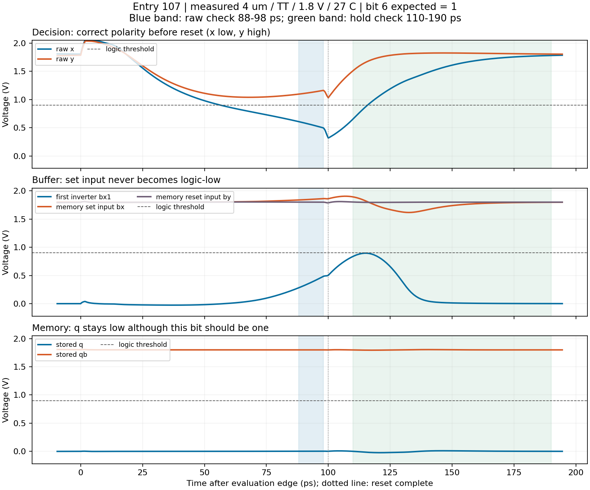

# Buffered DFE building block: decision improved, storage still fails

2026-09-06, Entry 107. Owner-approved follow-up to Entry 106. Rs/Cs, CTLE,
RL, product, cached demo and old report remain unchanged.

## Outcome

Adding transistor buffers improved the raw decision circuit from 15/32 to
**32/32 correctly resolved bits** at all three tested nominal sizes. However,
the memory still stores only zeros: the complete decision/hold gate remains
**15/32 and FAIL**. The hardware DFE is not complete or integrated.

| Total input width | Raw decisions correct | Held bits correct | DUT VDD power |
|---|---:|---:|---:|
| 4 um | 32/32 | 15/32 | 0.905883 mW |
| 8 um | 32/32 | 15/32 | 1.810409 mW |
| 16 um | 32/32 | 15/32 | 3.613041 mW |

The [frozen plan](DFE_BUFFER_PLAN.md) was followed: **3 calls / 10.412893 s**,
then stop because no size passes the complete nominal gate. No selected width,
PVT sweep, retry, further sizing or altered pass criterion. Simulator and
input/clock/buffer-trace integrity checks all pass; the failure is in the
observed circuit behaviour, not an absent waveform masquerading as success.

## What the waveforms tell us

All runs use TT / 1.8 V / 27 C, measured CTLE output common mode 1.364486680 V,
input differential levels +/-50 mV and the same external 5 GHz clock. Four
warmup bits and 32 scored bits are unchanged from Entry 106, as are every
decision/hold measurement window and the VDD/2 logic decoding rule.

The raw latch has the correct complementary polarity throughout 88-98 ps
after each evaluation edge. Maximum final stable-decision time is about
57.5 ps, with worst nominal logic margin about 0.194 V across the three sizes.
This is a deterministic block observation, not a noise/mismatch/BER guarantee.

For width 4 um and bit 6 (expected one):

- Raw x/y at 98 ps are approximately 0.4971/1.1625 V: correct polarity.
- First buffer output bx1 peaks at only 0.895247 V during the 0-190 ps window.
- The active-low memory set input bx never falls below 1.616793 V in that
  window, so this bit never provides a valid logic-low set signal.
- Memory q remains low; the whole block fails this bit's hold check.

Do not generalise the bit-6 observation to every buffer pulse: for 14/32 bits,
the relevant buffered input does cross below 0.9 V somewhere in 0-190 ps.
Nevertheless, q never crosses high in the entire scored interval: its maximum
is only 0.358203 V for 4 um, 0.354249 V for 8 um and 0.352142 V for 16 um.
Thus a brief threshold crossing also does not prove a successfully stored bit.

The evidence points to inadequate buffer/memory signal transfer within the
available time. Buffering changes the raw result, supporting the idea that
the original direct connection was problematic; it does not prove a unique
physical cause. The next design decision should target buffer drive ratios,
loading and storage timing independently, not uniformly enlarge every MOS.
Freeze those dimensions and a new small trial budget before any further run.
Do not relax the clock, input amplitude or accepted time windows to claim a pass.

## What remains before a transistor-level DFE

First get a decision AND stored-bit pass, including transitions, at nominal
and all specified PVT conditions. Then add the causal previous-bit register,
feedback summer and tap control. Finally connect the real CTLE, check loading,
kickback, closed-loop timing/eyes, mismatch/dynamic noise, and receiver power
and area. This experiment supplies no hardware feedback cancellation result.

## Power, area and evidence boundaries

The table includes all 27 MOS devices on the DUT supply. External clock net
power is separately 0.088320/0.179644/0.365738 mW; positive-supplied clock power
is 0.415047/0.767611/1.487976 mW. Neither is measured clock-generator power.
No full receiver power or new S6 pass is inferred from these partial numbers.

Gate W*L subtotals, including all eight buffer MOS, are
0.0000168/0.0000336/0.0000672 mm2. These are NOT full layout area; S7 remains
unverified. No PVT, physical feedback DFE, dynamic noise or system-eye claim.

- [Original raw summary](product_audits/entry107_dfe_buffer_20260906/summary.json):
  35 verified SHA256 entries, exact decks/logs, main and buffer waveforms,
  common-mode provenance and pre-run source snapshots. Original Entry 106 is
  also retained and reproduced by tests; no old numbers were overwritten.
- [Read-only diagnosis](product_audits/entry107_dfe_buffer_analysis_20260906/diagnosis.json):
  zero new simulator calls, independent reparse of raw decisions/held bits,
  buffer amplitude diagnostics and a visually checked plot.
- Implementation: explicit `--buffered` on `exp_dfe_slicer`; the default
  still produces the old unbuffered circuit. Existing stimulus and gate reused.
- Full suite: **2861 passed before / 2879 after**, 13 deselected and two
  unchanged warnings. Before 438.15 s, after 568.90 s. All 18 new tests pass;
  focused DFE group 42 passed. No experiment or test job remains running.

Professor-ready takeaway: "Buffers fixed the nominal raw decisions in our
test, but the stored output still fails. We identified a buffer/storage timing
problem, stopped at the nominal gate, and have not claimed a working hardware
DFE or replaced the validated behavioural product path."
