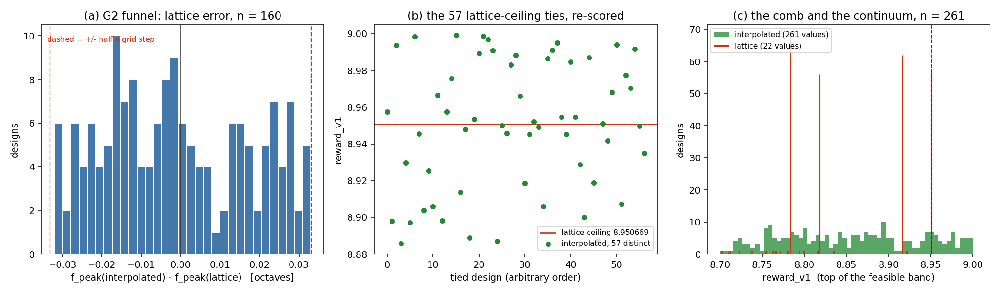

# PEAK_INTERP.md — task 1: the reward ceiling, at its source

**Run 2026-08-19, session 22e, at commit `9f9eca8`** (the pre-registration
commit; `PREDICTIONS.md` entry 9 was written and committed before any number
below existed). Serial, single process, nothing else simulating (G70).

**Total cost: 8360 simulations, 2065 s.** Zero of them are extra: the
interpolation reads a curve the same ngspice invocation already produced.

---

## 0. The result in six lines

1. **The ceiling is GONE, not moved.** The 57 designs that tied at +8.950669
   across 8000 simulations now hold **57 distinct rewards**, spanning
   **8.885654 … 8.999160**. One design is at the top; nothing is tied with it.
2. **29 of the 57 score ABOVE the old ceiling and 28 below**, which is the
   pre-registered number (28) to within one design — the lattice point sits
   0.0247 octaves *below* the target, so exactly half the grid cell moves
   closer.
3. **The vertex is right, not merely finer.** Against a `dec 500` reference the
   lattice error is **0.01726 octaves** and the interpolated error is
   **0.000100 octaves** — a **172× reduction**, with **0 of 14** designs where
   interpolation is worse.
4. **Nothing published moved.** All four task-0 pools reproduce their
   `n_s3`, `n_at_ceiling`, `invalid_rate`, `best_reward` **and their
   `ceiling_design_ids` sets**, exactly. All 276 checkable funnel designs
   reproduce `f_pk_hz` at rel=0.
5. **But it is a slightly different problem, not only a finer metric.**
   **63 designs in 8000 change feasibility** — 39 gain it, 24 lose it, net
   +15 on 1291. Verdicts flip in both directions while the rate stays
   essentially flat; §5 argues these are corrections, on the strength of (3).
6. **One design in 4543 is refused**, by the argmax cross-check rather than by
   a sweep edge, on a response flat to 2 × 10⁻¹⁰ dB. It is a new gotcha (G93)
   and it is the guard doing its job.

*(a) the lattice error on the 300-design G2 funnel, flat across the whole cell
and hard-bounded at ±half a grid step. (b) the 57 ties, re-scored. (c) the same
population's reward: a **comb** of 22 lattice values against a continuum.*

---

## 1. What was wrong, in one paragraph

`meas ac g_pk MAX vd_db` returns the largest **sample**, and the deck sweeps
`ac dec 50 1meg 100g` — a lattice **0.0664386 octaves** apart. `reward_v1`'s
feasible branch is `B + min_i(margin_i/tol_i)` and `S3_f_peak`'s margin is
`0.5 − |log2(f_peak/f_target)|` octaves, so the reward inherits the lattice
exactly. The mid-window target is 1.767767 GHz; the nearest grid point is
1.737801 GHz, **0.0246654 octaves below**; hence the best attainable score is
`8 + (0.5 − 0.0246654)/0.5` = **8.950669** (G74). Task 0 measured the
consequence: **57 distinct designs at that one value across 8000 simulations,
nothing above** — a plateau exactly where a policy gradient has to point.

The fix does not raise `dec`. It fits the parabola through the three samples
bracketing the discrete maximum, in `(log2 f, dB)`, and takes its vertex
(`device/sky130_runner.interpolate_peak_log_f`). The curve is already dumped by
`run_point(ac_sweep=True)`.

---

## 2. Is the vertex RIGHT, or merely finer?

**The question the other two sub-experiments cannot answer.** A parabola fitted
to a response that is not locally quadratic would move the number smoothly and
confidently in the wrong direction, and every statistic in this file would look
identical. So 30 funnel designs were run twice — once at the shipped `dec 50`
and once at **`dec 500`** (step 0.0066439 octaves) — and the dense run's
*interpolated* peak is the reference both `dec 50` numbers are measured against.

| against the `dec 500` reference, n = 14 | median | p10 | p90 | max |
|---|---|---|---|---|
| \|error\| of the **lattice** peak, octaves | **0.017265** | 0.00749 | 0.02358 | 0.03099 |
| \|error\| of the **interpolated** peak, octaves | **0.000100** | 0.0000071 | 0.000426 | 0.000646 |
| \|error\| of the lattice peak, dB | 0.0000762 | — | — | 0.000487 |

**Error reduction 172×. Designs where interpolation is worse than the lattice:
0 of 14.** 16 of the 30 were skipped because they have no interior peak at one
or both densities — the funnel is 47 % sweep-edge at `cl_mid` (G44, and
`ATTRIBUTION.md`'s 40.13 %), so that attrition is the population's, not the
method's.

This is a **validation, not a cost change.** Nothing in any deliverable sweeps
`dec 500`; raising `dec` is the owner's decision and is not being proposed.

**And the vertex is numerically trustworthy at the flattest peak measured.**
`wrdata` writes 8 significant figures, so a ~10 dB magnitude carries ~10⁻⁷ dB of
write noise. The *smallest* curvature `|y0 − 2y1 + y2|` seen on the funnel is
**7.04 × 10⁻⁵ dB — 704× that noise** — and the implied worst-case uncertainty on
the vertex position is **4.7 × 10⁻⁵ octaves**, two and a half orders below the
lattice error it removes.

---

## 3. How far off the lattice was — the G2 funnel

300 designs replayed from `g2_closed_loop_run.jsonl` through the **identical
deck** (`swing=True, ac_sweep=True, hd3=True`, corner tt, `cl` = 32.63 fF, drawn
passives, real mirror).

**Reproduction first, conclusions second: all 276 designs carrying a published
`f_pk_hz` reproduced it at rel=0.** The other 24 rows never reached that stage
in the original funnel.

| | value |
|---|---|
| designs with an interior peak | **160** of 300 |
| refused: still rising at 20 GHz (**G44, top**) | 122 |
| refused: monotonically falling (**bottom**) | 18 |
| median \|Δf_peak\| | **0.015858 octaves** |
| p10 / p90 of Δf_peak (signed) | −0.02557 / +0.02523 |
| max \|Δf_peak\| | 0.033094 |
| designs outside ±half a grid step (0.033219) | **0** |
| fraction shifted by < 0.001 octaves | 2.5 % |
| median Δpeaking | +0.000074 dB |

The shift is **flat across the cell** (figure (a)) — which is what a rounding
error looks like, and is the evidence that G74's account of the ceiling was
complete. The magnitude barely moves: 7 × 10⁻⁵ dB median, because the vertex of
a shallow parabola sits only just above the sample that defined it. **The
lattice cost frequency resolution, not gain resolution.**

### The two G44 guards, side by side

| | interpolated guard says edge | says interior |
|---|---|---|
| **discrete guard says edge** | 122 | 13 |
| **discrete guard says interior** | **0** | 165 |

**The empty cell is the important one.** The interpolated guard never rejects a
design the discrete guard accepts, so nothing that reaches `meas` today would be
newly thrown away. The 13 in the other corner are responses nearly flat at the
top: `g_pk − g_top ≤ 0.25 dB` fires while the argmax is still interior, i.e. the
discrete guard is the stricter of the two and remains the operative one.

---

## 4. The 57 ties — the question that matters for G3

All four task-0 pools re-run at their own seeds (`exp_difficulty.run_pool`,
unchanged), with `ac_peak_interp=True` as the only difference.

### 4.1 The replay is the same experiment

| pool | n_s3 | published | ties | published | invalid | published | best | published | ids match |
|---|---|---|---|---|---|---|---|---|---|
| unscreened r0 | 142 | 142 | 9 | 9 | 0.3780 | 0.3780 | 8.95066958 | 8.95066958 | ✔ |
| screened r0 | 511 | 511 | 16 | 16 | 0.2635 | 0.2635 | 8.95066958 | 8.95066958 | ✔ |
| unscreened r1 | 144 | 144 | 5 | 5 | 0.3860 | 0.3860 | 8.95066958 | 8.95066958 | ✔ |
| screened r1 | 494 | 494 | 27 | 27 | 0.2500 | 0.2500 | 8.95066958 | 8.95066958 | ✔ |

The screened arms even drew the same **6645** and **6746** proposals.
**Falsification condition 1 did not fire.** Everything below is measured on the
same 8000 evaluations task 0 published.

### 4.2 The ties separate completely

| | lattice | interpolated |
|---|---|---|
| designs at the best score | **57** | **1** |
| distinct reward values among those 57 | **1** | **57** |
| best score | 8.950670 | **8.999160** |
| range spanned by the 57 | 0 | 8.885654 … 8.999160 |
| median gap between adjacent ties | — | 1.28 × 10⁻³ |
| smallest gap between adjacent ties | — | 6.86 × 10⁻⁵ |
| refused by the interpolation | — | **0** |
| binding spec | S3_f_peak | S3_f_peak (57 of 57) |

**29 above the old ceiling, 28 below** — and the mechanism is the
pre-registered one, confirmed directly: **29 of the 57 have a positive vertex
offset**, i.e. exactly half the cell, because the lattice point sits below the
target.

**Is the separation real, or fourth-decimal noise?** The pre-registration's own
guard against over-claiming asked this, so it gets a number rather than an
assurance. The reward converts at **2 units per octave** (`tol` = 0.5), so §2's
vertex uncertainty becomes:

| | octaves | reward units |
|---|---|---|
| vertex uncertainty at the **median** funnel curvature (3.4 × 10⁻³ dB) | 9.9 × 10⁻⁷ | 2.0 × 10⁻⁶ |
| vertex uncertainty at the **flattest** curvature seen (7.0 × 10⁻⁵ dB) | 4.7 × 10⁻⁵ | 9.4 × 10⁻⁵ |
| **median** adjacent gap among the 57 | — | **1.28 × 10⁻³** |
| **smallest** adjacent gap among the 57 | — | 6.86 × 10⁻⁵ |
| gap between adjacent **lattice** reward values | — | 3.42 × 10⁻² |

So: the median gap is **640×** the typical uncertainty and **14×** even the
worst-case one, and the 57 span **0.1135** reward units — a third of the
distance between two lattice values. **The ranking as a whole is measuring the
circuit.** But the *closest pair* is separated by 6.9 × 10⁻⁵, which is **inside**
the worst-case bound, so those two designs are not strictly ordered by this
measurement and should not be reported as if they were. The pool log does not
carry per-design curvature, so which pair it is cannot be checked from the run —
that is an instrument gap (§8), not a result.

**Beyond the 57: 45 designs in 8000 now score above 8.950669.** The extra 16 all
had discrete reward **8.916453** — the *adjacent* lattice cell, one grid step
further from the target — and their true peaks lie in the part of that cell that
reaches inside. The old ceiling was hiding a real ordering in both directions.

### 4.3 The task-0 metric it retires

Task 0's headline instrument was **simulations-to-ceiling**, invented because
best-score-at-budget saturates. It is now undefined: the supremum is 9.0 and is
unattainable (it needs `f_peak` exactly on target, and the reward is a `min`
over specs so another one binds first). Best-score-at-budget is a usable
discriminator again on P1 at nominal. **This does not make the sweep worth
running** — see §6.

---

## 5. What actually changed about the problem, and it is not nothing

`S3_f_peak`'s margin crosses zero at S3's window edges (1.25 / 2.5 GHz), and
moving `f_peak` by up to a third of a grid step moves designs across that edge.

| | lattice | interpolated |
|---|---|---|
| feasible (all 7 V1 specs met) of 8000 | 1291 | **1306** |
| gained feasibility | — | **39** |
| lost feasibility | — | **24** |
| per-arm feasible, unscr r0 / scr r0 / unscr r1 / scr r1 | 142 / 511 / 144 / 494 | 145 / 513 / 146 / 502 |

**63 designs change verdict, 0.79 % of the population, in both directions, for a
net +1.2 % on the rate.** This is exactly the shape session 22b's prediction B
ran into with G66: *a per-design effect can flip verdicts both ways while the
population rate stays flat.* It is recorded here as a **change to the problem**,
not folded into "the metric got finer".

**Which verdicts are right?** §2 answers it as directly as anything in this
repository can: against a 10× denser sweep the interpolated peak is **172×**
closer to the truth, and it is never worse. So the 63 flips are **corrections to
misclassifications the lattice was making**, not new errors — but they are 63
changed S3 answers, and moving any published baseline onto the interpolated path
is therefore a `BASELINES.md` §7f event and a human decision (§7).

---

## 6. What this does NOT show

**The problem did not get harder.** Task 0 measured the S3 rate at **7.10 %** and
**75 % of screened restarts reaching the ceiling inside a 150-simulation
budget**; a continuous objective over the same population is still that
population. What changed is the **shape of the objective at its optimum** — a
57-design plateau became a gradient — and that is a statement about whether a
policy gradient can point anywhere near the optimum, not about whether PPO can
climb it, and not about whether G3's arms would separate. Difficulty is task 3's
axis (corners in the loop, ~1 in 1890 corner-and-load robust), not this one.

**Nothing here validates the interpolated peak against silicon**, only against a
denser sweep of the same simulator on the same netlist.

**And `S3_peaking` is untouched in practice.** The magnitude moves by 7 × 10⁻⁵ dB
against a 1.0 dB tolerance. If a future ceiling appears on the peaking row, this
change will not have caused it and will not remove it.

---

## 7. The decisions this surfaces, all human

1. **Does the benchmark move onto the interpolated path?** It would change 63 of
   8000 S3 verdicts (§5) and retire `simulations-to-ceiling`. `BASELINES.md`
   §7f: every baseline would have to be re-run. Not adopted here — the flag is
   default-off everywhere and `V1_SPECS` is untouched.
2. **What should a refused interpolation score?** Today it is the invalid floor.
   It fired **once in 4543** valid designs (§8), on a design already at −2.018,
   so nothing measured turns on it — but "we cannot locate the peak" scoring
   −10 where the lattice scored −2.018 is a hole in the landscape, and the
   alternative (fall back to the lattice value) is defensible. The bottom-edge
   case is already handled the second way, deliberately.
3. **Do the corner and load screens need re-running?** They were measured on
   lattice `f_peak`. Given §5's 0.79 % verdict-flip rate, the answer is probably
   "only if the benchmark moves", but it interacts with G66's own re-run scope
   and both should be costed together before task 3 spends compute.

---

## 8. What broke, and one new gotcha

**One design in 4543 was refused, and not for the reason expected.**
`unscreened r1`, trial 386, `design_id 89780188e55329c0`. Not a sweep edge:

> the Python argmax (5.49541e+07 Hz) and `meas ac MAX` (5.7544e+07 Hz) name
> different samples, 0.0664385 octaves apart

Its curvature is **−2.0 × 10⁻¹⁰ dB** — three adjacent samples equal to ten
decimal places. `meas` works on the full-precision vector; `wrdata` writes 8
significant figures; on a response that flat, the rounding is enough to swap
which sample is largest, and the two argmaxes broke the tie one grid step apart.
**Without the cross-check the interpolation would have refined the wrong cell
and reported a shift of a full grid step — twice the hard bound — silently.**
That is **G93**.

**Also worth recording as a near miss in the instrument, not the result:** the
per-trial log carries `Trial.meas` but not `EvalResult.raw`, so the refusal
*reason* was not in the 8000-row log and had to be recovered by re-deriving the
LHS stream for that arm and re-simulating the one design. That worked only
because the unscreened arm simulates every proposal exactly once, which makes
the stream re-derivable without the simulator. On the screened arm it would not
have been.

---

## 9. Cost

| | simulations | wall | s/sim |
|---|---|---|---|
| funnel replay | 300 | 93.9 s | 0.3169 median (swing + hd3 + dump) |
| dense validation | 60 | 15.3 s | — |
| pool replay | 8000 | 1954.4 s | 0.2443 |
| **task-0 pools, published** | 8000 | 1830.6 s | 0.2288 |

**The dump's cost is not separable from run-to-run variation, and saying so is
G71's discipline.** The aggregate ratio is **1.068×**, against G2's tier table
predicting **1.158×** for `+AC dump`. But the two *published* replicates of the
same arm differ by **1.178×** (unscreened) and **1.117×** (screened) from each
other, with no code difference at all. A 6.8 % increment inside a 17.8 % spread
is not a measurement of the increment. The honest statement: **the interpolation
costs no simulations, and its wall-clock cost is below this machine's own
run-to-run noise.**

---

## 10. Files

* `experiments/exp_peak_interp.py` — the three sub-experiments and the analysis
* `experiments/peak_interp_funnel.jsonl` — 300 rows, §3
* `experiments/peak_interp_dense.jsonl` — 30 rows, §2
* `experiments/peak_interp_pools.jsonl` — 4 pool summaries + 17 391 trial rows, §4
* `figures/peak_interp.png`
* `device/sky130_runner.py` — `interpolate_peak_log_f`, `parabolic_vertex`,
  `MAX_SEARCH_BOT_HZ`, and the three new `Sky130Point` fields
* `rl/evaluator.py` — `meas_with_interpolated_peak`, `INTERP_KEYS`
* `tests/test_peak_interp.py` — 23 tests
* `PREDICTIONS.md` entry 9 — pre-registration and outcome
