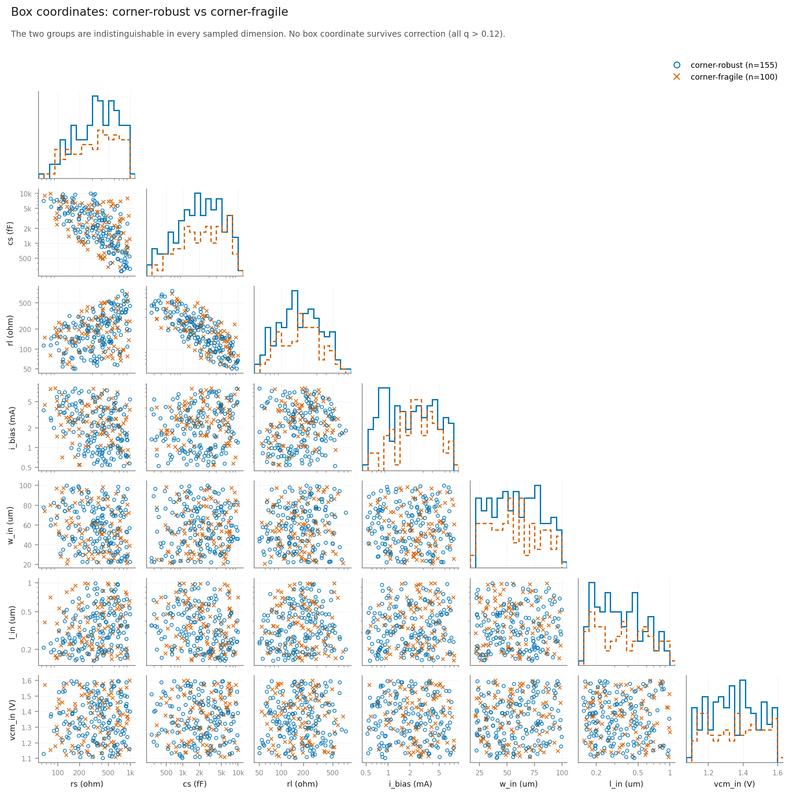
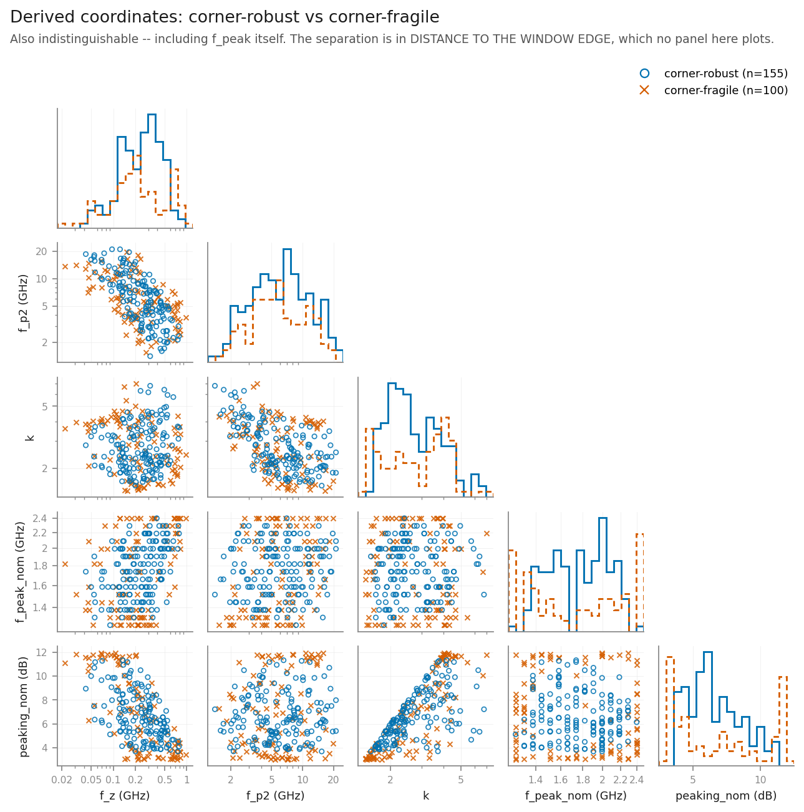
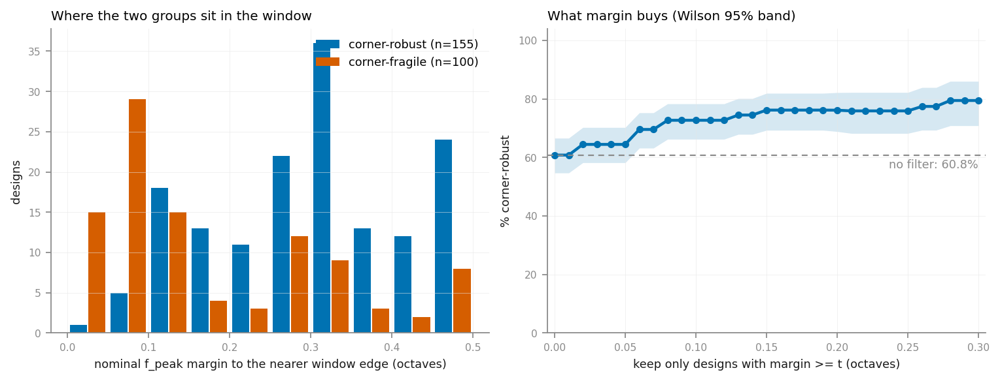
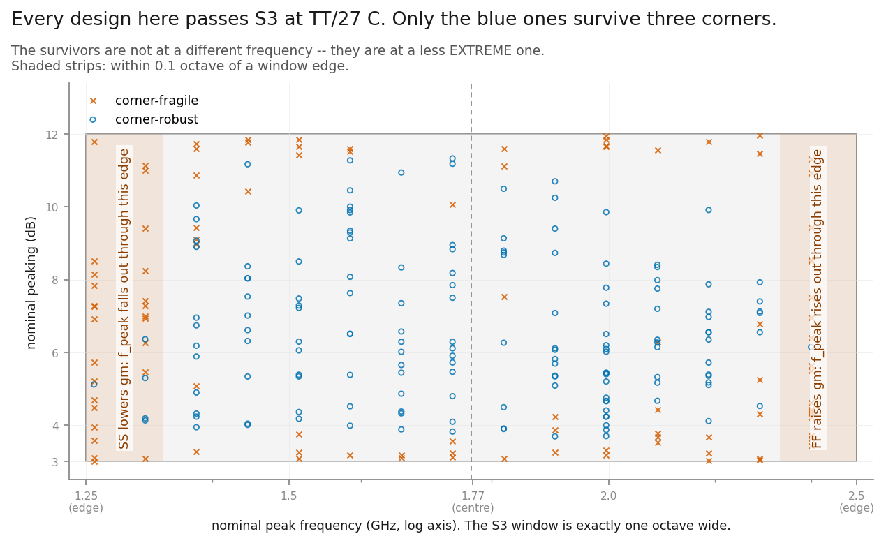

# Where the corner-robust designs live: not in the box, in the window

**Date:** 2026-08-05 (session 11) · **Simulator:** ngspice 41, trimmed SKY130
library (G36) · **7 560 SPICE runs, 23 min** (1890 designs x 4 corners).
**All coordinates are TT / 27 °C.**

`S9_YIELD.md` §4 established that **100 of the 255 designs that meet every spec
at nominal fail at a corner**. It reported the count. This asks where those 100
sit, and the answer turns out to be usable rather than merely interesting.

**The hypothesis was half right, and the wrong half is the more useful half.**

> **Hypothesis (from G46).** FF raises gm and pushes f_peak up through the
> 2.5 GHz top edge; SS lowers gm and drops peaking toward 0 dB. Robustness
> therefore requires f_peak centred enough that neither mechanism reaches it,
> so **the 155 corner-robust designs are interior in the box and the 100
> corner-fragile ones cluster near its edges**.

| claim | verdict |
|---|---|
| robust designs are interior **in the parameter box** | **FALSIFIED.** All eight sampled dimensions, plus two direct measures of box interiority, are indistinguishable between the groups (every q > 0.08; box interiority q = 0.98, the least significant row in the table) |
| robustness needs f_peak **centred in the spec window** | **CONFIRMED**, overwhelmingly: median margin 0.325 vs 0.126 octaves, p = 2.8e-12 |
| …and the same holds on S3's **other** axis | **CONFIRMED, and it was not predicted**: peaking margin 2.70 vs 0.86 dB, p = 3.2e-11 |

The sentence worth keeping: **corner robustness is not a property of where a
design sits in the parameter box; it is a property of where it sits in the spec
window.** Those are different spaces, and only the second one predicts.

Reproduce — no simulator needed, the collected data is committed:

```
python -m nebula.experiments.robust_geometry            # analysis + figures
python -m nebula.experiments.robust_geometry --collect  # re-simulate, ~23 min
python -m pytest nebula/tests/test_robust_geometry.py -q
```

`common/params.py` is untouched (CLAUDEwa §8 rule 6). §7 is the proposal.

---

## 0. Read this before the numbers: this is a re-simulation

The task was framed as *"no new SPICE — it uses data you already have"*. **We
did not have it.** Session 10d's 20 205-run, 47-minute sweep wrote
`nebula/experiments/s9_yield_results.json`; `.gitignore` line 67 lists that
filename under *"run artifacts — regenerable"*. It was never committed and it
is not on disk. The only surviving record of that run is the prose in
`S9_YIELD.md`. It would not have been sufficient anyway: it stored counts and
design indices, not the per-design `f_peak` and `peaking` values this analysis
needs. New gotcha **G49**.

The population was therefore **reproduced from the seed** — Latin-hypercube
sampling is deterministic, so `sample_box(PROPOSED_BOX, 2000, 20260804)` → pin
`cl` at 150 fF → drop what `headroom_ok_1v8` rejects at the nominal rail gives
back the same 1890 designs for free — and re-simulated at TT plus the three
screen corners.

**That makes 10d's published counts a reproduction check, and it is asserted,
not assumed:**

```
n_designs 1890 · TT winners 255 · corner-robust 155 · corner-fragile 100
reproduction   OK -- matches S9_YIELD.md
```

`check_reproduction()` returns the discrepancies and `main()` refuses to draw a
figure if there are any. All four matched exactly, which is a stronger
statement than it looks: it says the box, the seed, the `cl` pin, the headroom
filter, the corner plumbing, the spec checker and the peak detector all still
produce, design for design, what they produced in session 10d.

**The collected table is now committed** as
`nebula/experiments/robust_geometry_data.csv` (1890 rows, lossless `repr`
floats). Every number and figure below regenerates from it with no simulator.

### The standing caveat, unchanged

**The tail is still two ideal current sinks.** An ideal sink does not lose
current at SS/125 °C and does not fall out of saturation at 0.95 VDD, so every
corner spread here — and therefore the size of the effect measured below — is
an **understatement**. The margins recommended in §7 are those needed against
the input pair's spread alone. Expect them to grow, not shrink, once a real
tail exists (HANDOFF §8, top open item).

---

## 1. Method

- **Groups.** *Corner-robust* = passes every spec at TT **and** at all three
  screen corners (155). *Corner-fragile* = passes at TT, fails at least one
  screen corner (100). The two partition the 255 TT winners; the 1635 designs
  that fail at TT are in neither group.
- **Corners.** `tt/1.00/27` plus `ss/0.95/125`, `ff/1.05/0`, `ss/0.95/0` —
  `s9_yield.py`'s `SCREEN_CORNERS`, unmodified. Verdicts come from
  `evaluate_at_corner` itself, so the label and the coordinates plotted against
  it come from the *same* evaluation (rule 9: one definition). This is the
  3-corner definition of robust; `S9_YIELD.md` §3 measured that 153 of these
  155 also survive all 45.
- **Test.** Mann-Whitney U, two-sided, tie-corrected, normal approximation with
  continuity correction — held to `scipy.stats.mannwhitneyu` by a parametrised
  test rather than to a hand-copied number. A rank test because nothing here is
  Gaussian: five of the nine parameters are sampled log-uniformly and f_peak
  spans decades.
- **Correction.** Twenty coordinates against one grouping, so every p carries a
  Benjamini–Hochberg **q**. At α = 0.05 an uncorrected table this wide expects
  one spurious hit.
- **Effect size.** `P(R>F)`, the common-language effect size: the chance a
  random robust design exceeds a random fragile one. 0.5 is no effect. It is
  reported because at n = 255 a difference can be significant and still be
  useless as a design rule.

---

## 2. The box does not know which designs are robust

| coordinate | robust | fragile | P(R>F) | p | q |
|---|---|---|---|---|---|
| `rs` (Ω) | 364.1 | 365.2 | 0.517 | 0.652 | 0.811 |
| `cs` (fF) | 2086 | 2363 | 0.463 | 0.318 | 0.800 |
| `rl` (Ω) | 183.5 | 188.4 | 0.487 | 0.725 | 0.811 |
| `i_bias` (mA) | 1.998 | 2.492 | 0.422 | 0.035 | 0.168 |
| `w_in` (µm) | 57.81 | 54.15 | 0.530 | 0.421 | 0.800 |
| `l_in` (µm) | 0.3087 | 0.3482 | 0.463 | 0.315 | 0.800 |
| `vcm_in` (V) | 1.338 | 1.371 | 0.482 | 0.628 | 0.811 |
| `nf_in` | 5 | 5 | 0.532 | 0.388 | 0.800 |
| **box interiority (min over dims)** | 0.067 | 0.075 | 0.501 | **0.981** | 0.981 |
| **box interiority (mean over dims)** | 0.272 | 0.277 | 0.503 | 0.936 | 0.981 |



Nothing. Not one sampled dimension separates the groups after correction, and
the two statistics built specifically to test the hypothesis — normalised
distance to the nearest box face, as a min over dimensions and as a mean — are
the *least* significant rows in the entire table. The medians differ in the
third digit.

The pairwise scatter says the same by eye: the orange and blue clouds are the
same cloud. The only structure visible in any panel is the `rs`–`cs` and
`cs`–`rl` anti-correlation, which is the S3 window being satisfied at all
(f_z ∝ 1/RsCs, f_p2 ∝ 1/RlCl) and applies equally to both groups.

**Why the hypothesis was wrong.** It conflated two spaces. Being interior in
the *box* means no coordinate is near a sampling bound — but those bounds are
where they are because of `headroom_ok`, the SKY130 W-bin limit and the range
that was measured (`BOUNDS_REDERIVATION.md` §6), not because designs near them
are fragile. **Corners do not move a design's parameters; they move its
response.** A design is fragile when its response starts near a *spec* edge,
and a response can be near a spec edge from anywhere in the box.

Two methodological notes, both of which would have manufactured a false
positive here:

- **`nf_in` is excluded from the interiority statistic.** It is sampled
  continuously and then rounded to an integer in 1..8, so every design landing
  on nf = 1 or 8 has a normalised position of exactly 0 or 1 and would floor
  the min-interiority of roughly two sevenths of the population for a rounding
  reason. It keeps its own row in the table above.
- **Normalised positions use the log mapping for log-sampled axes.** Reading
  `rs` (50–1000 Ω, log-sampled) on a linear scale puts its geometric centre at
  u = 0.18 — apparently near the low edge — and would produce exactly the
  "fragile designs sit near an edge" pattern this experiment exists to test
  for. A test pins this.

**One honest near-miss.** `gm/I_D` (9.18 vs 6.97, p = 0.014) and `i_bias`
(2.00 vs 2.49 mA, p = 0.035) both point the same way — robust designs run
leaner and at higher gm efficiency — but **neither survives correction**
(q = 0.086 and 0.168). Recorded as suggestive and unproven. The mechanism is
plausible (a design carrying more gm than it needs has more gm to lose at SS)
and it would be cheap to test on a fresh seed. It is not claimed here.

---

## 3. The window does, on both of its axes

| coordinate | robust | fragile | P(R>F) | p | q |
|---|---|---|---|---|---|
| `f_peak` (GHz) — raw | 1.738 | 1.738 | 0.520 | 0.594 | 0.811 |
| `peaking` (dB) — raw | 6.291 | 6.337 | 0.519 | 0.615 | 0.811 |
| **`f_peak` margin (octaves)** | **0.325** | **0.126** | **0.759** | **2.8e-12** | **5.3e-11** |
| **`peaking` margin (dB)** | **2.704** | **0.859** | **0.746** | **3.2e-11** | **3.0e-10** |



**The raw coordinates and the folded ones are computed from the same numbers
and give opposite answers. That is the finding.** Median `f_peak` is 1.738 GHz
in both groups — identical to four figures. Median peaking differs by 0.05 dB.
On those two rows the two populations are the same population.

Fold each coordinate onto its distance from the *nearer* spec edge and the
separation is overwhelming. The robust designs are **not at a different
frequency — they are at a less extreme one**, and the same is true of their
peaking. A two-sided spec makes the raw coordinate uninformative by
construction: a design at 1.30 GHz and one at 2.40 GHz are both one small
corner shift from failing, and they sit on opposite sides of any median, so
they cancel.

The starkest single number: **0 of the 155 robust designs sit within 0.5 dB of
a peaking edge, against 37 of the 100 fragile ones.** The rank test on raw
peaking cannot see that at all.

This is the same trap as G40 and G43 in a new place. There, a statistic was
contaminated by a population that failed two conditions together. Here, a
statistic is blinded by averaging two failure modes that point in opposite
directions. **In both cases the fix is to ask the question in the coordinate
the spec is written in, not the one the simulator happens to report.**

### The measurement resolution, stated because it bounds every threshold below

`meas ac g_pk MAX` returns the largest **sample**, and the netlist sweeps
`ac dec 50`. So `f_peak` can only land on that grid: one step is
log2(10)/50 = **0.0664 octaves**, and S3's one-octave window contains exactly
**15 distinct f_peak values** in this dataset. Any margin threshold quoted
finer than ~0.07 octaves is quoting the sweep setup rather than the circuit.
It is why the threshold table below has repeated rows (t = 0.100 and t = 0.125
select the same 205 designs) and why the margin histogram has empty bins. A
test pins all three facts.

---

## 4. What the margin buys



P(corner-robust | f_peak margin ≥ t), over the 255 TT winners, Wilson 95 %:

| t (oct) | kept | robust | rate | 95 % CI |
|---|---|---|---|---|
| 0.000 (no filter) | 255 | 155 | **60.8 %** | [54.7, 66.6] |
| 0.066 (one grid step) | 220 | 153 | 69.5 % | [63.2, 75.2] |
| 0.133 (two steps) | 192 | 143 | **74.5 %** | [67.9, 80.1] |
| 0.200 | 155 | 118 | 76.1 % | [68.8, 82.2] |
| 0.300 | 107 | 85 | 79.4 % | [70.8, 86.0] |

The curve rises steeply to about 0.13 octaves and then **flattens** — past two
grid steps, more frequency margin buys almost nothing. That plateau is the
useful part: the required margin is small and specific, not "as central as
possible".

Read from the other end the filter is sharper than those ratios suggest:
**33 of the 100 fragile designs sit within one grid step of a window edge,
against 2 of the 155 robust ones.** Within two steps it is 51 against 12.

### Both axes together — the number to actually use

Neither margin alone gets past ~80 %, because a design can be comfortable in
frequency and one dB above the peaking floor. Requiring both:

| f_peak ≥ (oct) | peaking ≥ (dB) | kept | robust | rate | 95 % CI |
|---|---|---|---|---|---|
| 0 | 0 | 255 | 155 | 60.8 % | [54.7, 66.6] |
| 0 | 1.0 | 187 | 141 | 75.4 % | [68.8, 81.0] |
| 0.133 | 0 | 192 | 143 | 74.5 % | [67.9, 80.1] |
| **0.133** | **1.0** | **140** | **129** | **92.1 %** | **[86.5, 95.6]** |
| 0.200 | 1.0 | 111 | 105 | 94.6 % | [88.7, 97.5] |
| 0.200 | 1.5 | 96 | 92 | 95.8 % | [89.8, 98.4] |

**Two grid steps of frequency margin plus one dB of peaking margin take corner
robustness from 60.8 % to 92.1 %, while keeping 55 % of the nominal winners.**

The two conditions are worth far more together than apart — 74.5 % and 75.4 %
alone, 92.1 % jointly — which is what you would expect if they guard two
independent failure routes. Note the contrast with G40, which measured the two
S3 conditions to be independent as *pass* conditions at nominal: independence
of the conditions is not independence of the failure routes their margins
guard, and this is the first place in the project where the two S3 axes have
been shown to interact at all.

---

## 5. The G46 mechanism, checked rather than repeated

Where the fragile design sat, and which corner killed it. A design can be
counted in both columns; 86 of the 100 died at exactly one corner, 12 at two,
2 at all three.

| nominal f_peak | died at FF | died at SS |
|---|---|---|
| above the 1.77 GHz centre | 29 | 27 |
| below the 1.77 GHz centre | **10** | **45** |

First failure by spec, per corner, among the 100 fragile designs:

| corner | failures | first failure |
|---|---|---|
| `ss/0.95/125` | 69 | S3_f_peak 40, S3_peaking 26, saturation 3 |
| `ff/1.05/0` | 39 | S3_f_peak 19, S3_peaking 19, S6_power 1 |
| `ss/0.95/0` | 8 | S3_f_peak 5, S3_peaking 3 |

**Half of G46's mechanism reproduces cleanly and half needs correcting, and the
correction is not cosmetic.** A design sitting *below* the centre is killed by
a slow corner 4.5 times more often than by the fast one (45 vs 10) — exactly as
predicted. But a design sitting *above* the centre is killed **about equally by
both** (29 vs 27). It is tempting to read that row as "predominantly FF"; the
data does not support it, and 29-vs-27 on 56 events is a coin flip.

The resolution is in the second table: **SS has two ways to kill a design and
FF has one.** Lower gm drops `f_peak` (killing low-side designs) *and* drops
`peaking` toward the 3 dB floor (killing any design with little peaking margin,
wherever it sits in frequency). SS's 69 failures split 40/26 between those two
routes; FF's split 19/19. So the top-edge designs die at FF *and* at SS, by
different mechanisms — which is exactly why §4 needs both margins and neither
alone is enough.

**This does not contradict G46**, and the distinction is worth stating because
it is easy to garble: G46 was about the *promotion* stage — among the 155
designs that had already survived the three screen corners, the remaining
45-corner failures all landed at hot **ff/sf** corners, so the screen's blind
spot is fast-hot. Here, among the 1890 designs entering the screen, slow-hot
removes the most. Both are true; they answer different questions. *Which corner
kills the most designs?* — `ss/0.95/125`. *Which corner does the existing
screen miss?* — fast-hot.

**Robustness itself is symmetric about the window centre**, which is the
cleanest confirmation that the two edges matter equally: designs below the
centre are 60.9 % robust [52.4, 68.8], designs above it 60.7 % [51.8, 68.9].

---

## 6. The figure



Every one of the 255 markers is inside the S3 box: all of them pass the spec at
nominal. The shaded strips are within 0.1 octave of a window edge. The result
is legible without any statistics — the edges are orange, the middle is blue —
and it makes the case for corner-aware scoring in one image: **an optimiser
that stops at TT cannot tell these two populations apart, because at TT they
are the same population.**

---

## 7. Proposal (NOT written into `params.py`)

Rule 6 reserves parameter ranges for a human. This is not a bound change — the
box is unchanged, and §2 is the finding that the box is not where the
information is. It is a proposal about the **search**, in two places:

> **1. Warm start.** Seed the policy — and any baseline that gets one — from
> designs with `f_peak` margin ≥ 0.133 octaves **and** peaking margin ≥ 1.0 dB.
> Measured: 92.1 % [86.5, 95.6] of such designs are corner-robust, against
> 60.8 % of TT winners overall, at the cost of discarding 45 % of them. Both
> quantities come out of an AC run the evaluator already performs, so the
> filter is free.
>
> **2. Reward shaping.** Score S3 on the two **folded margins** rather than on
> `peaking` and `f_peak` directly — distance to the nearer edge, in octaves for
> frequency and dB for magnitude. §3 shows the raw coordinates carry no
> information about corner robustness while the folded ones carry essentially
> all of it. This is consistent with the task-6 reward sketch
> (`-|log10(f_peak/f_target)|`) and sharpens it: the target is not an arbitrary
> point but the window's geometric **centre at 1.7678 GHz**, and the natural
> unit is the octave, because S3's window is exactly one octave wide.

Three things a human should weigh before adopting either:

- **The margins are measured against an ideal tail** and are therefore lower
  bounds (§0). Re-measure once the tail transistor lands; the plateau in §4 may
  move right.
- **The thresholds are in-sample.** They are fitted on the same 255 designs
  they are quoted from, so they will be optimistic. A fresh seed costs 23
  minutes and would make them out-of-sample.
- **A margin requirement narrows the reachable spec range, and S3 demands
  *tunable* 3–12 dB.** A 1.0 dB peaking margin bans the endpoints of exactly
  that range: a design tuned to deliver 3.0 dB has no peaking margin by
  definition. The honest reading is that this rule belongs on the **search**,
  not on the deliverable — it says where to look for a robust design, not what
  the equaliser is allowed to output. Whether the 3 dB and 12 dB endpoints are
  corner-robust *at all* in this topology is a separate question this data
  cannot answer, and it is worth asking directly (§9).

---

## 8. What this does NOT say

- **It says nothing about causation.** Margin predicts robustness; it was not
  shown to produce it. The obvious confound is that both are driven by
  something upstream — `gm/I_D` is the candidate (§2) — and this dataset cannot
  separate them.
- **It is one seed.** 255 winners from one 2000-sample Latin hypercube. The
  effect is far too large to be sampling noise (p ~ 1e-12), but the *threshold*
  values in §4 and §7 are in-sample and will be optimistic.
- **It is the 3-corner definition of robust**, not the 45-corner one. The
  difference is two designs (`S9_YIELD.md` §3).
- **Every coordinate is TT.** That is the point — the filter has to be
  computable before you pay for corners — but nothing here describes behaviour
  *at* a corner.
- **The tail is ideal, `cl` is pinned at 150 fF, and VCM does not track VDD.**
  The three assumptions `s9_yield.py` prints in every run header apply
  unchanged, and the first of them dominates.
- **It does not license removing anything from the box.** §2 found no
  difference between the groups in any dimension; that is not evidence a
  dimension is useless, only that it does not predict *this* label.
- **It is not a coupled constraint.** The margin rule is a filter on the
  response, not a statement that the box cannot be searched axis-alignedly.
  G40 stands.

---

## 9. What to do next

1. **Re-run on a fresh seed** to make the §7 thresholds out-of-sample. 23 min,
   no new code — `--collect --seed <new>`, plus relaxing the reproduction gate,
   which is deliberately keyed to session 10d's counts.
2. **Add the tail transistor**, then re-run this unchanged. Every margin here
   is a lower bound until that exists.
3. **Test the `gm/I_D` near-miss properly** (§2). If robust designs really do
   run leaner, that is a second free prior and a more physical one.
4. **Ask whether the 3 dB and 12 dB endpoints of S3's tunable range are
   corner-robust at all** (§7). If they are not, that is a finding about the
   topology and belongs in the report — not a problem with the margin rule.
